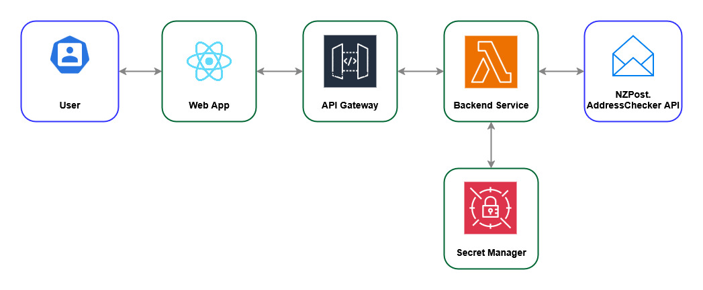

## Assumptions

Below assumptions are made for the implementation of this solution.

- It is assumed that "real-time address validation... ...as the user types" in the task description means that user will
  be able to enter any part of a New Zealand address and the application will provide suggestions for valid addresses
  that match the input.
- No authentication/authorization is required for the web application.

## User Guide

- Web application can be accessed at the URL: https://test-web-app-1990-05-31.s3.ap-southeast-2.amazonaws.com/index.html
- In the text field with label "Enter NZ Address", the user can enter any part of a New Zealand address.
- As the user types, the application will drop down real-time suggestions for valid addresses which match the input.
  (suggestions are fetched only after 0.4 ms of inactivity after typing the last character)
- The user can select a suggestion from the dropdown list to fill the text field with the selected address and it can be
  determined as a valid NZ Postal address.
- Project task tracking is done through the [github issue ](https://github.com/rmsamitha/nz-address-checker/issues/1)[1]

## System Design & Architecture

The solution implements a serverless web application hosted on AWS infrastructure to provide a prototype implementation
of real-time New Zealand address validation using the NZPost.AddressChecker API. The system consists of several
components that work together to handle user requests securely and efficiently

Abstract Design of the Implementation is illustrated below.

Figure-1: Abstract Design of the Implementation

The objective and purpose of each above components and used technologies are described below.

**1. User/Browser**  
The user interacts with the React web application via a browser. Address inputs trigger API calls to retrieve real-time
address suggestions.

**2. Web Application**  
The React frontend web application is hosted as a static website in Amazon S3. It communicates with backend services
through HTTPS requests to API Gateway.

**3. API Gateway**  
AWS API Gateway acts as the entry point for API requests from the frontend. It routes requests to AWS Lambda, and
manages CORS for cross-origin calls.

**4. Service Implementation**  
The backend service logic is implemented as an AWS Lambda function using Java. It processes user input queries,
retrieves
secrets from AWS Secrets Manager, generate an Oauth token to
call [NZPost.AddressChecker API [2]](https://anypoint.mulesoft.com/exchange/portals/nz-post-group/b8271f09-2ad8-4e1c-b6b1-322c5727d148/nzpost.addresschecker/),
and then calls it with the obtained token to obtain address suggestion results.

- Invoked API Resource: GET https://api.nzpost.co.nz/addresschecker/1.0/suggest
- Token retrieved from the token call is valid for 24 hours. So the Lambda function caches the token for reuse
  within that period to avoid unnecessary calls to the token endpoint.
- The HTTP Client used in the Lambda function is Apache HttpClient and it is configured to reuse the same client
  instance for all the requests to the NZPost.AddressChecker API/Token EP.

**5. Secrets Manager**  
AWS Secrets Manager, which is used as the secrets manager stores client credentials required to call the token endpoint
of NZPost.AddressChecker API. Lambda retrieves these credentials securely at runtime, ensuring no secrets are hardcoded
or exposed.

**6. NZPost.AddressChecker API**  
The external NZPost.AddressChecker API validates the parts of addresses passed and returns suggestions that are close to
the passed text. Lambda formats the response and returns it to the frontend.

### Data Flow in the System

1. The user enters an address in the React web application.
2. The React app sends the query to AWS API Gateway.
3. API Gateway forwards the request to the Java Lambda function.
4. Lambda retrieves API credentials from AWS Secrets Manager and calls the token endpoint and NZPost.AddressChecker API.
5. The NZPost.AddressChecker response is formatted by Lambda and returned to the React application via API Gateway.

## Explanation of design / technology choices

Here’s a short list of **reason points for each technology**:

### 1. Web App – React

* **Fast, responsive UI** using virtual DOM and state management.
* **Component-based architecture** for reusable and modular code.
* Ideal for **real-time address suggestions** and interactive forms.
* **Large ecosystem** and easy integration with REST APIs.

### 2. API Gateway – AWS API Gateway

* **Serverless integration** with Lambda (no server management).
* **Secure API exposure** with CORS, throttling, and authorization.
* **Auto-scaling** and high availability for backend requests.
* **Cost-effective pay-per-use** pricing.

### 3. Backend Service – Java Lambda Function

* **Enterprise-grade reliability** with strong static typing.
* **Robust API handling** with mature libraries like Apache HttpClient.
* **Great performance on warm starts** (JVM JIT optimizations).
* **Easy to implement complex logic** for calling external APIs (NZ Post API).

### 4. Secret Management – AWS Secrets Manager

* **Secure storage of sensitive credentials** (API keys, secrets).
* **Encrypted at rest** using AWS KMS.
* **Seamless runtime retrieval** from Lambda (no hardcoding).
* **Automatic rotation** and centralized secret management.

## TODO Next

- Introduce CloudFront as a CDN in front of the S3 bucket to improve performance and security.
- Unit test is implemented for testing purposes at development time, but it is not complete. Need to complete the unit
  tests to run in isolation. (need to mock Secrets Manager access, etc)
- Can implement UI tests using Cypress or similar tools for the React application.
- Access to Lambda function should be protected so that it can only be invoked by AWS API Gateway (and not directly by
  public clients). Can use resource-based policies (Lambda function policies). These policies would define which AWS
  services or principals can invoke the Lambda function.
- Should configure CORS properly so that requests (web browser calls) only from this React app would be allowed to
  access the AWS API Gateway endpoint. The value of hosted/exposed URL of the React app can be set to the header 
  "Access-Control-Allow-Origin" of the response from Lambda function/Gateway API. (currently it is set to "*")

[1] Task tracking Git Hub Issue - https://github.com/rmsamitha/nz-address-checker/issues/1

[2] NZPost.AddressChecker
API - https://anypoint.mulesoft.com/exchange/portals/nz-post-group/b8271f09-2ad8-4e1c-b6b1-322c5727d148/nzpost.addresschecker/
